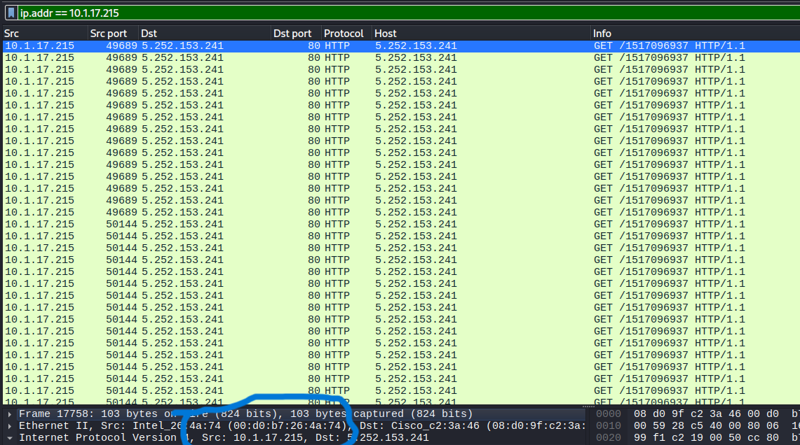

# **Traffic Analysis Exercise – Fake Google Authenticator Infection**

## 💑 **Table of Contents**
- [Description](#description)  
- [Tools and Technologies Used](#tools-and-technologies-used)  
- [Environment](#environment)  
- [Step 1 - Identifying the Infected Host IP](#step-1---identifying-the-infected-host-ip)  
- [Step 2 - Correlating the MAC Address](#step-2---correlating-the-mac-address)  
- [Step 3 - Extracting the Hostname](#step-3---extracting-the-hostname)  
- [Step 4 - Identifying the User Account](#step-4---identifying-the-user-account)  
- [Step 5 - Detecting the Fake Domain](#step-5---detecting-the-fake-domain)  
- [Step 6 - Extracting the C2 Infrastructure](#step-6---extracting-the-c2-infrastructure)  
- [Step 7 - Analyzing the Malicious Payload](#step-7---analyzing-the-malicious-payload)  
- [Step 8 - Validating Indicators on VirusTotal](#step-8---validating-indicators-on-virustotal)  
- [Conclusion](#conclusion)

---

## **Description**
This investigation simulates the workflow of a **Security Operations Center (SOC) analyst** responding to a malware incident.  

A user reported downloading a suspicious “Google Authenticator” application, which matched recent threat intelligence advisories. I received a **packet capture (PCAP)** of the infected machine’s traffic and performed step-by-step analysis in **Wireshark** to confirm the infection, identify compromised infrastructure, and extract indicators of compromise (IOCs).  

By the end of the analysis, I was able to piece together the full infection chain — from the initial DNS query, to malicious command-and-control (C2) servers, and finally to the obfuscated payload designed to persist and evade detection.  

---

## **Tools and Technologies Used**
- **Wireshark** → traffic filtering, packet inspection, endpoint statistics  
- **PCAP analysis** → reconstructing infection flow  
- **VirusTotal** → cross-checking suspicious domains and IPs against global threat intelligence feeds  

---

## **Environment**
- **LAN Segment**: 10.1.17.0/24  
- **Gateway**: 10.1.17.1  
- **Domain Controller**: 10.1.17.2 (WIN-GSH54QLW48D)  
- **AD Domain**: BLUEMOONTUESDAY  

These details gave me the network baseline — any deviation from normal traffic patterns inside this range could point to the infected client.

---

## **Step 1 - Identifying the Infected Host IP**
I began by using **Wireshark’s Statistics → Endpoints feature**, which provides a quick overview of which hosts are communicating the most on the network.  

Immediately, one client stood out: **10.1.17.215**, responsible for **39,045 packets** — far more than any other system in the capture.  
In incident response, unusually high packet counts are often a sign of malicious activity such as beaconing, downloads, or C2 communication.  


---

## **Step 2 - Correlating the MAC Address**
Once the infected IP was isolated, I needed its **MAC address**. This is useful in real-world SOCs when analysts must tie traffic back to a physical device.  

I filtered Wireshark traffic for the infected IP and inspected the Ethernet header of a packet. From here, I correlated the **source MAC address** with the suspicious IP.  



---

## **Step 3 - Extracting the Hostname**
Next, I wanted the **hostname** of the infected machine. There are multiple ways to obtain this (such as NBNS queries), but in this case I inspected **DHCP Request packets**.  

Inside the DHCP options field, the hostname was exposed as:  
**DESKTOP-L8C5GSJ**  

This step confirmed that `10.1.17.215` was not only suspicious by traffic count, but also mapped to a real host on the LAN.  


---

## **Step 4 - Identifying the User Account**
To attribute activity further, I searched for **Kerberos traffic**, which often reveals usernames through the `CNameString` field.  

By filtering for the infected IP alongside Kerberos traffic, I found the account name:  
**shutchenson**  

This gave me a clear link between the infected traffic and a specific user identity within the environment.  


---

## **Step 5 - Detecting the Fake Domain**
The original report mentioned a fake *Google Authenticator* installer. To uncover the domain, I applied a DNS filter:  

```wireshark
(dns && dns.flags.response == 0) && dns.qry.name matches "(google|google-authenticator|auth)"
```  

This allowed me to capture only client-initiated DNS queries related to Google/authenticator terms.  

Two domains stood out:  
- `google-authenticator.burleson-appliance.net`  
- `authenticatoor.org`  

The second domain was particularly suspicious: **authenticatoor.org** contained a typo (double "o"), a common tactic in typosquatting campaigns.  


---

## **Step 6 - Extracting the C2 Infrastructure**
Next, I needed to know where those domains resolved to. By filtering for DNS responses, I extracted A records:  

The domains resolved to multiple IPs, but deeper inspection via Wireshark’s **Statistics → Endpoints** revealed two key C2 servers actively contacted by the infected host:  
- **82.221.136.26**  
- **104.21.64.1**  

These IPs stood out not just because they resolved, but because of the **volume of active connections** tied to the infected machine.  

  
  


---

## **Step 7 - Analyzing the Malicious Payload**
To understand what the malware was doing, I followed the **TCP streams** associated with the infected client.  

Two key findings emerged:  

1. **VBScript Execution**  
   - Script downloaded a remote payload from:  
     `http://5.252.153.241/api/file/get-file/29842.ps1`  
   - Used **`-WindowStyle Hidden`** and **`start /min`** → stealth execution.  
   - Opened `azure.microsoft.com` as a distraction for the victim.  

2. **Obfuscated PowerShell**  
   - Contained **Base64-encoded code**.  
   - Began with `iex ((system.convert)::...` → executes decoded commands.  
   - Used `.replace()` → simple string obfuscation to hinder analysis.  

  


---

## **Step 8 - Validating Indicators on VirusTotal**
Finally, I cross-checked suspicious IPs against **VirusTotal**.  

- `104.21.64.1` → flagged by several security vendors as **malicious**.  
- `82.221.136.26` → flagged for **phishing/suspicious activity**.  

This confirmed that the infrastructure I identified in the PCAP was indeed malicious.  

  


---

## ✅ **Conclusion**
Through systematic PCAP analysis, I reconstructed the entire infection chain:  

- **Infected Host**: `10.1.17.215`  
- **Hostname**: `DESKTOP-L8C5GSJ`  
- **User**: `shutchenson`  
- **Fake Domain**: `authenticatoor.org`  
- **C2 Servers**: `82.221.136.26`, `104.21.64.1`  
- **Payload Delivery**: VBScript → Hidden PowerShell → Remote download  

This case demonstrates how attackers abuse typosquatting, stealth scripting, and obfuscation to deliver malware — and how **Wireshark analysis** can expose every step of the attack.  
